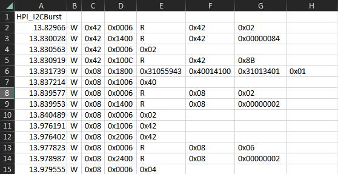

# Gadget - SALEAE automation 

#Screenshot


# How to use
- [ ] capture I2C in SALEAE Logic2 with 6.25Mbps, 3.3V digital mode
- [ ] enable Automation Server in SALEAE application, perference  
- [ ] install HPI_I2CBurst analyser (binary/i2c_analyzer_for_PD_nxsh.dll) in SALEAE extension library
- [ ] place all SALEAE logs into a folder
- [ ] ***CLOSE all running saleae logic2 applications
- [ ] exectue python command and this application will export SALEAE logs into .csv

```
C:\> py auto_saleae.exe -f <folder> -sda <SDA channel> -slk <SLK channel>
```

## Console Output
```
C:\> py auto_saleae.py -f test -sda 2 -slk 3
INFO:saleae.automation.manager:sub ChannelConnectivity.IDLE
INFO:saleae.automation.manager:sub ChannelConnectivity.CONNECTING
INFO:saleae.automation.manager:sub ChannelConnectivity.TRANSIENT_FAILURE
INFO:saleae.automation.manager:sub ChannelConnectivity.READY

C:\>
```

# How to generate standalone executable application (for Windows)
```
nuitka --standalone auto_saleae.py
```
Command becomes
```
C:\auto_saleae.dist> auto_saleae.exe -f test -sda 2 -slk 3
INFO:saleae.automation.manager:sub ChannelConnectivity.IDLE
INFO:saleae.automation.manager:sub ChannelConnectivity.CONNECTING
INFO:saleae.automation.manager:sub ChannelConnectivity.TRANSIENT_FAILURE
INFO:saleae.automation.manager:sub ChannelConnectivity.READY

C:\>
```